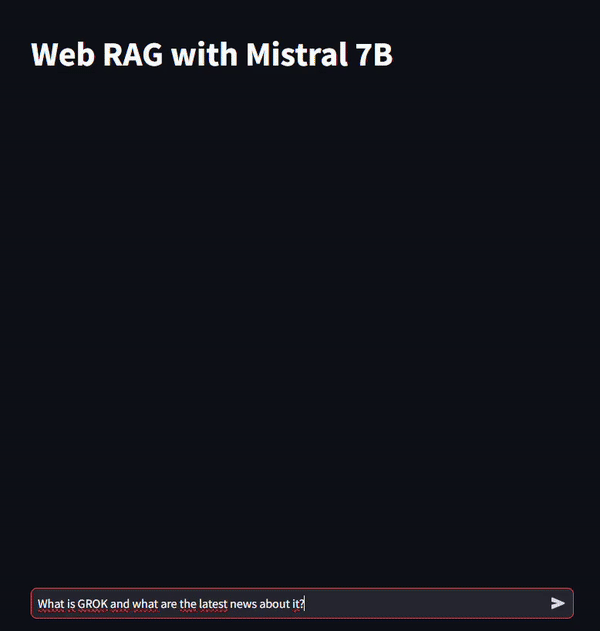

# Implementation of RAG with web search using Mistral 7B

## Introduction

This repository demonstrates a simple implementation of Retrieval-Augmented Generation (RAG) that exploits web search results utilizing the open-source language model, Mistral 7B, paired with an open-source embedding model, All MPNET Base v2.

Inspired by [OpenAI-Web-Search-RAG-LLM-API-with-BUN.js](https://github.com/developersdigest/OpenAI-Web-Search-RAG-LLM-API-with-BUN.js/blob/main/index.js).

This implementation focuses on providing enriched answers by retrieving relevant information from the web. Drastically better results could be obtained by using a larger and more powerful LLM, the web search retrieval process could also be improved with hierarchical web searches, conversational RAG, more computational resources, and a better browser API to improve search results quality.

## Features

- Utilization of Mistral 7B, an open-source LLM, for generating responses.
- Integration of All MPNET Base v2 for semantic similarity retrieval of web search results.
- Dockerized backend and frontend services for easy setup and deployment.

## Installation

### Prerequisites

- Docker and Docker Compose installed on your machine.
- A GPU.

### Setup

#### Option 1: Simultaneously start both services

1. **Clone the Repository**

```bash
git clone <repository-url>
cd simple_rag
```

2. **Start the Services**

Use Docker Compose to start both the backend and frontend services together.

```bash
docker compose up
```

This command reads the docker-compose.yml file at the root of the repository, which is configured to start both services as part of a single Docker network.

Once the services are up, open [http://localhost:8081](http://localhost:8081) in your web browser to access the application.

#### Option 2: Manually start each service

1. **Clone the Repository**

```bash
git clone <repository-url>
cd simple_rag
```

2. **Running the Backend API**

Navigate to the backend directory and start the Docker container.

```bash
cd backend
docker compose up
```

3. **Running the Frontend API**

Make sure the backend service is up and running before starting the frontend to ensure the shared network is up.

```bash
cd frontend
docker compose up
```

After successfully starting the services, open [http://localhost:8081](http://localhost:8081) in your web browser to interact with the application.

## Results

The following GIF shows the 4x sped up execution of the application for the query "What is GROK and what are the latest news about it?". Grok is the LLM of the company xAI, owned by Musk, which released the 314B weights of the model on the 17th of march 2024.

As can be seen, the model answers the question quite well, all given information is correct for points 1 to 4.

However, the informations detailed in items 5 and 6 are incorrect. Upon further examination, it appears that the model did not hallucinate, but simply relayed erroneous informations found in the last retrieved link to the daily.dev website, where the content of the article is simply false and/or very outdated. This shows a limitation of such application, a "small" LLM such as Mistral 7B is limited in its context size and its analysis and might not be able to detect contradictory information within its context.



## License

[MIT](https://choosealicense.com/licenses/mit/)